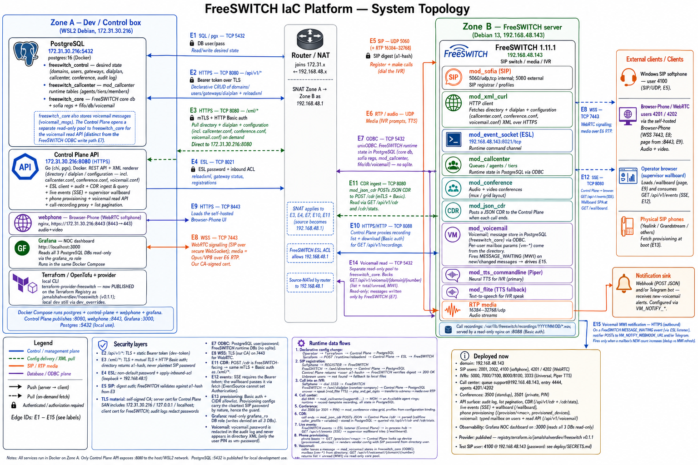

# FreeSWITCH IaC Platform

[](https://github.com/jamalshahverdiev/freeswitch-iac-platform/actions/workflows/ci.yml)
[](LICENSE)



Manage FreeSWITCH declaratively: configuration lives in **PostgreSQL** and is
managed with **Terraform** instead of hand-edited XML. FreeSWITCH pulls
directory / dialplan / module configs on demand via `mod_xml_curl` from a Go
**control-plane API**; runtime commands go over ESL.

```
Terraform ──► terraform-provider-freeswitch ──► Control-Plane API (Go)
                                                     │        ▲
                                       XML renderers │        │ ESL (reload / status)
                                                     ▼        │
                                    PostgreSQL   FreeSWITCH (mod_xml_curl)
```

The Terraform provider lives in its own repo:
**[terraform-provider-freeswitch](https://github.com/jamalshahverdiev/terraform-provider-freeswitch)**.

## What you can manage from Terraform

| Area | Resources |
|---|---|
| SIP directory | `freeswitch_domain`, `freeswitch_user` (a1-hash auth — plaintext passwords never leave the API) |
| Dialplan / IVR | `freeswitch_dialplan_extension` (nested condition/action blocks; TTS via flite or Piper) |
| Trunks | `freeswitch_gateway` |
| Call center | `freeswitch_callcenter_queue` / `_agent` / `_tier` / `_reload` — **runtime state in Postgres via ODBC, no sqlite** |
| Conferences | `freeswitch_conference_profile` / `_room` — composed **video grid** (mux), PIN rooms, auto-record |
| Apply hooks | `freeswitch_reloadxml`, `freeswitch_callcenter_reload` |
| Observability | data sources for config + runtime (registrations, gateway status, live conference members) |

Plus: per-day call recording tree (`YYYY/MM/DD/*.wav`) with a list/download
API, a self-hosted WebRTC softphone ([Browser-Phone](https://github.com/InnovateAsterisk/Browser-Phone))
served from compose, and the FreeSWITCH **core db moved to Postgres** too —
zero sqlite on the telephony host.

## Security model

- `/api/v1/*` — Bearer token over HTTPS.
- `/xml/*` (serves SIP secrets to FreeSWITCH) — HTTPS + **mTLS client cert** +
  HTTP Basic auth; unknown lookups return `not found` so FreeSWITCH falls back
  to its on-disk config and can't be broken by the binding.
- Directory responses carry **`a1-hash`** (MD5 digest), never the plaintext
  SIP password (verified with a real REGISTER, `hack/sip_register_test.py`).
- ESL: non-default password + source ACL. Audit log redacts secrets.
- Repo secrets are **age-encrypted** (`*.age` files, `hack/secrets.sh`).

MVP limitation: SIP passwords are stored plaintext in PostgreSQL (needed to
compute the a1-hash); the production path is secret refs / Vault.

## Layout

| Path | What |
|---|---|
| `control-plane/` | Go API: CRUD, XML renderers, ESL client, audit log |
| `docker-compose.yml` | `postgres` + `control-plane` + `webphone` (FreeSWITCH is external) |
| `deploy/freeswitch/` | Version-controlled configs for the FreeSWITCH host (xml_curl, ESL, ACL, ODBC, sofia profiles, recordings nginx) |
| `deploy/api-test.sh` | Full API regression (89 assertions, self-cleaning) |
| `deploy/seed.sh`, `seed-ivr.sh` | Demo data over the REST API |
| `examples/` | Working Terraform examples: IVRs (incl. neural TTS), WebRTC users, call center, video conferences |
| `webphone/` | Browser-Phone container (WebRTC softphone, audio+video) |
| `hack/` | TLS generation, backups + restore drill, secrets, e2e helpers |
| `docs/` | architecture, API reference, WebRTC/webphone guides |

## Quick start

Prereqs: Docker + compose, a FreeSWITCH 1.11 host you control, OpenTofu or
Terraform.

```bash
git clone https://github.com/jamalshahverdiev/freeswitch-iac-platform
cd freeswitch-iac-platform

# 1. Secrets: create your own (the committed *.age files are the authors')
cp .env.example .env          # set your passwords
bash hack/gen-tls.sh          # your own CA + server/client certs -> deploy/tls/

# 2. Control plane up
docker compose up -d --build
curl -s --cacert deploy/tls/ca.crt https://localhost:8080/readyz   # {"database":"ok",...}

# 3. Demo data + regression
./deploy/seed.sh && ./deploy/seed-ivr.sh
bash deploy/api-test.sh       # expect: 89 passed, 0 failed
```

Maintainers with the age key instead run `hack/secrets.sh decrypt`.

## Wire up the FreeSWITCH server

1. Copy `deploy/freeswitch/xml_curl.conf.xml` + `event_socket.conf.xml`
   (and merge `acl.conf.xml`) into `/etc/freeswitch/autoload_configs/`,
   adjusting the control-plane address and credentials.
2. Copy `deploy/tls/{ca.crt,client.crt,client.key}` to `/etc/freeswitch/tls/`
   (xml_curl uses them for mTLS).
3. Ensure `mod_xml_curl` is loaded, then `fs_cli -x "reload mod_xml_curl"`
   (changing the binding URL/credentials needs `reload mod_xml_curl`, NOT just
   `reloadxml`).
4. Optional but recommended: ODBC DSNs (`deploy/freeswitch/odbc/`) move
   mod_callcenter and the FreeSWITCH core db into your Postgres — no sqlite.
5. Declare your PBX: `cd examples/webrtc-users && tofu apply`.

## Docs

- [Architecture & topology](docs/architecture.md)
- [API reference](docs/api.md)
- [System overview](docs/SYSTEM-OVERVIEW.md)
- [WebRTC](docs/webrtc.md) / [Webphone](docs/webphone.md)
- [IVR audio & TTS](docs/ivr-audio.md), [custom prompts](docs/howto-custom-prompt.md)
- [Observability (Grafana NOC dashboard)](docs/observability.md)
- [Roadmap / improvement plan](docs/IMPROVEMENT-PLAN.md)

## Make targets

`make up | down | logs | ps | build | vet | test | tidy | smoke`

## License

MIT — see [LICENSE](LICENSE).
